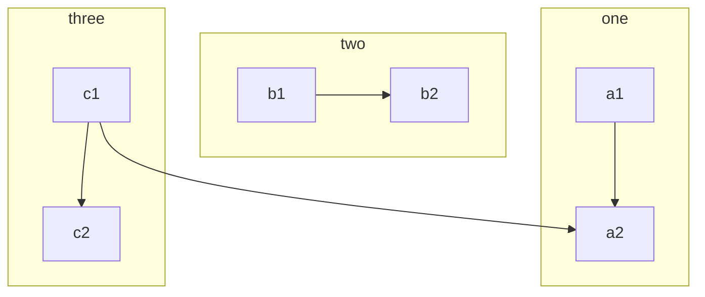
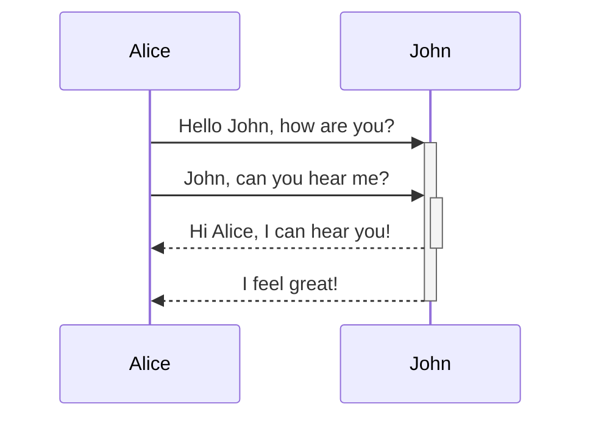
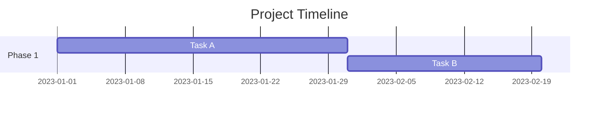
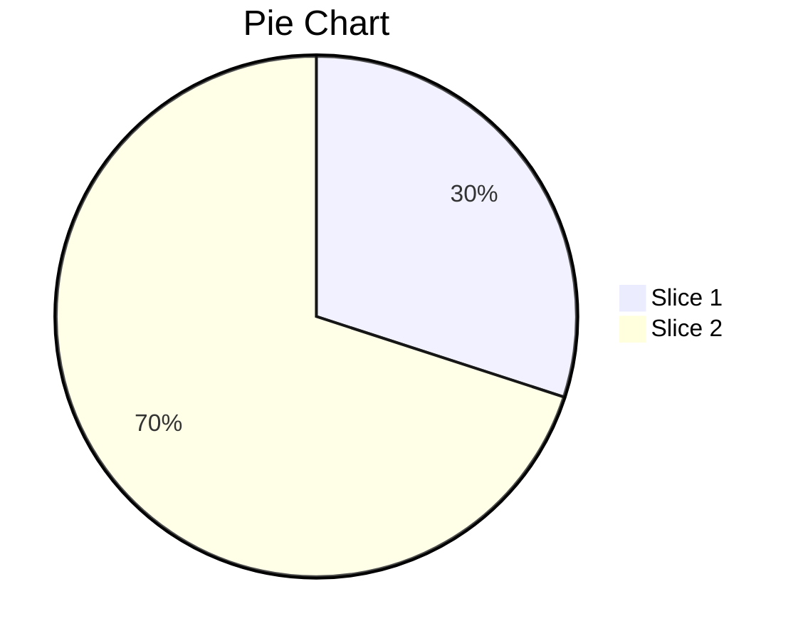

# Markdown Cheatsheet

This is my definitive Markdown cheatsheet. It includes all the Markdown syntax you need to know to create beautiful and professional-looking documents.

## Compilation [^formatting_github]

| Style                       | Syntax <kbd>char`\|text`char</kbd>                                                                                                                          | Keyboard shortcut                             | Example                                                                                                                                                                                    | Output                                                                                                                                                                                         |
| --------------------------- | ----------------------------------------------------------------------------------------------------------------------------------------------------------- | --------------------------------------------- | ------------------------------------------------------------------------------------------------------------------------------------------------------------------------------------------ | ---------------------------------------------------------------------------------------------------------------------------------------------------------------------------------------------- |
| Heading                     | <kbd>#`\|text`</kbd><br><kbd>##`\|text`</kbd><br><kbd>###`\|text`</kbd><br><kbd>####`\|text`</kbd><br><kbd>#####`\|text`</kbd><br><kbd>######`\|text`</kbd> | None                                          | <pre># A first-level heading<br>## A second-level heading<br>### A third-level heading<br>#### A fourth-level heading<br>##### A fifth-level heading<br>###### A sixth-level heading</pre> | <h1>A first-level heading</h1><h2>A second-level heading</h2><h3>A third-level heading</h3><h4>A fourth-level heading</h4><h5>A fifth-level heading</h5><h6>A sixth-level heading</h6>         |
| Horizontal Rule             | <kbd>---</kbd> or <kbd>\*\*\*</kbd>                                                                                                                         | None                                          | <pre>---<br>Text between Horizontal Rules<br>---</pre>                                                                                                                                     | <hr>Text between Horizontal Rules<hr>                                                                                                                                                          |
| Bold                        | <kbd>\*\*`\|text`\*\*</kbd> or <kbd>\_\_`\|text`\_\_</kbd>                                                                                                  | <kbd>Ctrl</kbd>+<kbd>B</kbd>                  | <pre>\*\*This is bold text\*\*</pre>                                                                                                                                                       | **This is bold text**                                                                                                                                                                          |
| Italic                      | <kbd>\*`\|text`\*</kbd> or <kbd>\_`\|text`\_</kbd>                                                                                                          | <kbd>Ctrl</kbd>+<kbd>I</kbd>                  | <pre>\_This text is italicized\_</pre>                                                                                                                                                     | _This text is italicized_                                                                                                                                                                      |
| Strikethrough               | <kbd>\~\~`\|text`\~\~</kbd>                                                                                                                                 | None                                          | <pre>\~\~This was mistaken text\~\~</pre>                                                                                                                                                  | ~~This was mistaken text~~                                                                                                                                                                     |
| Bold and nested italic      | <kbd>\*\*`\|bold`\_`\|italic`\_`\|bold`\*\*</kbd>                                                                                                           | None                                          | <pre>\*\*This text is \_extremely\_ important\*\*</pre>                                                                                                                                    | **This text is _extremely_ important**                                                                                                                                                         |
| Bold+Italic                 | <kbd>\*\*\_`\|bold-italic`\_\*\*</kbd>                                                                                                                      | None                                          | <pre>\*\*\_All this text is important\_\*\*</pre>                                                                                                                                          | **_All this text is important_**                                                                                                                                                               |
| Subscript                   | <kbd>\<sub>`\|text`\</sub></kbd>                                                                                                                            | None                                          | <pre>This is a \<sub>subscript\</sub> text</pre>                                                                                                                                           | This is a <sub>subscript</sub> text                                                                                                                                                            |
| Superscript                 | <kbd>\<sup>`\|text`\</sup></kbd>                                                                                                                            | None                                          | <pre>This is a \<sup>superscript\</sup> text</pre>                                                                                                                                         | This is a <sup>superscript</sup> text                                                                                                                                                          |
| Sub+Superscript             | <kbd>\<sup>\<sub>`\|text`\</sub>\</sup></kbd>                                                                                                               | None                                          | <pre>\<sup>\<sub>This is a very small text\</sub>\</sup></pre>                                                                                                                             | <sup><sub>This is a very small text</sub></sup>                                                                                                                                                |
| Quote                       | <kbd>>`\|quote`</kbd>                                                                                                                                       | <kbd>Ctrl</kbd>+<kbd>Shift</kbd>+<kbd>.</kbd> | <pre>> Text that is a quote</pre>                                                                                                                                                          | <blockquote>Text that is a quote</blockquote>                                                                                                                                                  |
| Nested Quote                | <kbd>>`\|quote`<br>>>`\|quote`</kbd>                                                                                                                        | <kbd>Ctrl</kbd>+<kbd>Shift</kbd>+<kbd>.</kbd> | <pre>> Main quote<br>>> Nested quote</pre>                                                                                                                                                 | <blockquote>Main quote<blockquote>Nested quote</blockquote></blockquote>                                                                                                                       |
| Inline code quote           | <kbd>\``\|code`\`</kbd>                                                                                                                                     | <kbd>Ctrl</kbd>+<kbd>E</kbd>                  | <pre>This has an \`inline quote code\` text</pre>                                                                                                                                          | This has an `inline quote code` text                                                                                                                                                           |
| Inline math quote           | <kbd>\$ `equation` \$</kbd>                                                                                                                                 | None                                          | <pre>\$\sqrt{3x-1}+(1+x)^2$</pre>                                                                                                                                                          | <math><mrow><msqrt><mrow><mn>3</mn><mi>x</mi><mo>-</mo><mn>1</mn></mrow></msqrt><mo>+</mo><msup><mrow><mo>(</mo><mn>1</mn><mo>+</mo><mi>x</mi><mo>)</mo></mrow><mn>2</mn></msup></mrow></math> |
| Block code quote            | <kbd>\`\`\`<br>`\|multi-lined-code`<br>\`\`\`</kbd>                                                                                                         | <kbd>Ctrl</kbd>+<kbd>E</kbd>                  | <pre>This has a<br>\`\`\`<br>Block<br>quote<br>code<br>\`\`\`</pre>                                                                                                                        | This has a <pre>Block<br>quote<br>code</pre>                                                                                                                                                   |
| Block math quote            | <kbd>\$\$<br>`\|equation`<br>\$\$</kbd> or <kbd>\`\`\`math<br>`\|equation`<br>\`\`\`</kbd>                                                                  | None                                          | <pre>\$\$<br>f(x) = x^2<br>\$\$</pre>                                                                                                                                                      | <math><mrow><mi>f</mi><mo>(</mo><mi>x</mi><mo>)</mo><mo>=</mo><msup><mi>x</mi><mn>2</mn></msup></mrow></math>                                                                                  |
| Unordered List              | <kbd>- `\|item`</kbd><br><kbd>\* `\|item`</kbd><br><kbd>+ `\|item`</kbd>                                                                                    | <kbd>Ctrl</kbd>+<kbd>Shift</kbd>+<kbd>8</kbd> | <pre>- Unordered List Item<br>\* Unordered List Item<br>+ Unordered List Item</pre>                                                                                                        | <ul><li>Unordered List Item</li><li>Unordered List Item</li><li>Unordered List Item</li></ul>                                                                                                  |
| Ordered List                | <kbd>1. `\|item`</kbd>                                                                                                                                      | <kbd>Ctrl</kbd>+<kbd>Shift</kbd>+<kbd>7</kbd> | <pre>1. Ordered List Item<br>1. Ordered List Item<br>1. Ordered List Item</pre>                                                                                                            | <ol><li>Ordered List Item</li><li>Ordered List Item</li><li>Ordered List Item</li></ol>                                                                                                        |
| Task List                   | <kbd>- \[ \] `\|item`</kbd>                                                                                                                                 | None                                          | <pre>- [ ] Task List Item<br>- [x] Task List Item</pre>                                                                                                                                    | <input type="checkbox"> Task List Item<br><input type="checkbox" checked> Task List Item                                                                                                       |
| Nested List                 | Combine any List syntax                                                                                                                                     | None                                          | <pre>1. First list item<br>&nbsp;&nbsp; - First nested list item<br>&nbsp;&nbsp;&nbsp;&nbsp; - Second nested list item</pre>                                                               | <ol><li>First list item<ul><li>First nested list item<ul><li>Second nested list item</li></ul></li></ul></li></ol>                                                                             |
| Inline Link                 | <kbd>\[`\|text`\]\(`\|url` "`\|hover`"\)</kbd>                                                                                                              | None                                          | <pre>\[GitHub Pages](https://pages.github.com/ "hover info")</pre>                                                                                                                         | [GitHub Pages](https://pages.github.com/ "hover info")                                                                                                                                         |
| Inline Image Link           | <kbd>\!\[`alt-text`](`\|url` "`\|hover`")</kbd>                                                                                                             | None                                          | <pre>\!\[](https://picsum.photos/100/100)</pre>                                                                                                                                            |                                                                                                                                                 |
| Reference Link              | <kbd>\[`ref_tag`]: `\|url` "`\|hover`"</kbd>                                                                                                                | None                                          | <pre>\[git_page]: https://pages.github.com/ "hover info"</pre>                                                                                                                             |                                                                                                                                                                                                |
| Inline Link with Ref.       | <kbd>\[`\|text`]\[`ref_tag`]</kbd>                                                                                                                          | None                                          | <pre>\[GitHub Pages]\[git_page]</pre>                                                                                                                                                      | [GitHub Pages][git_page]                                                                                                                                                                       |
| Inline Image Link with Ref. | <kbd>\!\[`alt-text`]\[`ref_tag`]</kbd>                                                                                                                      | None                                          | <pre>\!\[]\[100x100]</pre>                                                                                                                                                                 | ![][100x100]                                                                                                                                                                                   |
| Table                       | <kbd>\| Header 1 \| Header 2 \|<br>\| --- \| --- \|<br>\| Cell A1 \| Cell A2 \|<br>\| Cell B1 \| Cell B2 \|</kbd>                                           | None                                          | <pre>\| Header 1 \| Header 2 \|<br>\| --- \| --- \|<br>\| Cell A1 \| Cell A2 \|<br>\| Cell B1 \| Cell B2 \|</pre>                                                                          | <table><thead><tr><th>Header 1</th><th>Header 2</th></tr></thead><tbody><tr><td>Cell A1</td><td>Cell A2</td></tr><tr><td>Cell B1</td><td>Cell B2</td></tr></tbody></table>                     |
| Footnote                    | <kbd>\[^footnote\]: `\|text-and-or-link`</kbd>                                                                                                              | None                                          | <pre>\[^footnote\]This is a footnote</pre>                                                                                                                                                 | This has a footnote. [^footnote]                                                                                                                                                               |
| Collapsible Section         | <kbd>\<details><br>\<summary>`\|summary`\</summary><br><br>`\|text`<br>\</details></kbd>                                                                    | None                                          | <pre>\<details><br>\<summary>Click to expand\</summary><br>This is hidden<br>\</details></pre>                                                                                             | <details><summary>Click to expand</summary>This is hidden</details>                                                                                                                            |
| Emoji[^github_emoji]        | <kbd>:`\|emoji`:</kbd>                                                                                                                                      | None                                          | <pre>`:rocket:`</pre>                                                                                                                                                                      | :rocket:                                                                                                                                                                                       |
| Escaping Characters         | <kbd>\\`\|char`</kbd>                                                                                                                                       | None                                          | <pre>Not \\\*\\\*bold\\\*\\\*</pre>                                                                                                                                                        | Not \*\*bold\*\*                                                                                                                                                                               |
| Hidden Comment              | <kbd>\<!--`\|hidden comment`--></kbd>                                                                                                                       | None                                          | <pre>\<!--This is a hidden comment--></pre>                                                                                                                                                |                                                                                                                                                                                                |
| Keyboard Inputs             | <kbd>\<kbd>`\|key`\</kbd></kbd>                                                                                                                             | None                                          | <pre>Use \<kbd>Ctrl\</kbd> + \<kbd>Z\</kbd> to undo</pre>                                                                                                                                  | Use <kbd>Ctrl</kbd> + <kbd>Z</kbd> to undo                                                                                                                                                     |
| Text Box                    | <kbd>\<table><br>\<td\><br>`\|text`<br>\</td\>\</table></kbd>                                                                                               | None                                          | <pre>\<table><br>\<td\><br>This is text in the `box`<br>\</td\>\</table></pre>                                                                                                             | <table><td>This is text in the `box`</td></table>                                                                                                                                              |

---

## 1. Text Formatting

| Style                  | Syntax <kbd>char`\|text`char</kbd>                         | Example                                                        | Output                                          |
| ---------------------- | ---------------------------------------------------------- | -------------------------------------------------------------- | ----------------------------------------------- |
| Bold                   | <kbd>\*\*`\|text`\*\*</kbd> or <kbd>\_\_`\|text`\_\_</kbd> | <pre>\*\*This is bold text\*\*</pre>                           | **This is bold text**                           |
| Italic                 | <kbd>\*`\|text`\*</kbd> or <kbd>\_`\|text`\_</kbd>         | <pre>\_This text is italicized\_</pre>                         | _This text is italicized_                       |
| Bold and nested italic | <kbd>\*\*`\|bold`\_`\|italic`\_`\|bold`\*\*</kbd>          | <pre>\*\*This text is \_extremely\_ important\*\*</pre>        | **This text is _extremely_ important**          |
| Bold+Italic            | <kbd>\*\*\_`\|bold-italic`\_\*\*</kbd>                     | <pre>\*\*\_All this text is important\_\*\*</pre>              | **_All this text is important_**                |
| Strikethrough          | <kbd>\~\~`\|text`\~\~</kbd>                                | <pre>\~\~This was mistaken text\~\~</pre>                      | ~~This was mistaken text~~                      |
| Subscript              | <kbd>\<sub>`\|text`\</sub></kbd>                           | <pre>This is a \<sub>subscript\</sub> text</pre>               | This is a <sub>subscript</sub> text             |
| Superscript            | <kbd>\<sup>`\|text`\</sup></kbd>                           | <pre>This is a \<sup>superscript\</sup> text</pre>             | This is a <sup>superscript</sup> text           |
| Sub+Superscript        | <kbd>\<sup>\<sub>`\|text`\</sub>\</sup></kbd>              | <pre>\<sup>\<sub>This is a very small text\</sub>\</sup></pre> | <sup><sub>This is a very small text</sub></sup> |

---

## 2. Headings & Dividers

| Style           | Syntax <kbd>char`\|text`char</kbd>                                                                                                                          | Example                                                                                                                                                                                    | Output                                                                                                                                                                                 |
| --------------- | ----------------------------------------------------------------------------------------------------------------------------------------------------------- | ------------------------------------------------------------------------------------------------------------------------------------------------------------------------------------------ | -------------------------------------------------------------------------------------------------------------------------------------------------------------------------------------- |
| Heading         | <kbd>#`\|text`</kbd><br><kbd>##`\|text`</kbd><br><kbd>###`\|text`</kbd><br><kbd>####`\|text`</kbd><br><kbd>#####`\|text`</kbd><br><kbd>######`\|text`</kbd> | <pre># A first-level heading<br>## A second-level heading<br>### A third-level heading<br>#### A fourth-level heading<br>##### A fifth-level heading<br>###### A sixth-level heading</pre> | <h1>A first-level heading</h1><h2>A second-level heading</h2><h3>A third-level heading</h3><h4>A fourth-level heading</h4><h5>A fifth-level heading</h5><h6>A sixth-level heading</h6> |
| Horizontal Rule | <kbd>---</kbd> or <kbd>\*\*\*</kbd>                                                                                                                         | <pre>---<br>Text between Horizontal Rules<br>\*\*\*</pre>                                                                                                                                  | <hr>Text between Horizontal Rules<hr>                                                                                                                                                  |

---

## 3. Quotes and Code

| Style             | Syntax <kbd>char`\|text`char</kbd>                                                         | Example                                                             | Output                                                                                                                                                                                         |
| ----------------- | ------------------------------------------------------------------------------------------ | ------------------------------------------------------------------- | ---------------------------------------------------------------------------------------------------------------------------------------------------------------------------------------------- |
| Quote             | <kbd>>`\|quote`</kbd>                                                                      | <pre>> Text that is a quote</pre>                                   | <blockquote>Text that is a quote</blockquote>                                                                                                                                                  |
| Nested Quote      | <kbd>>`\|quote`<br>>>`\|quote`</kbd>                                                       | <pre>> Main quote<br>>> Nested quote</pre>                          | <blockquote>Main quote<blockquote>Nested quote</blockquote></blockquote>                                                                                                                       |
| Inline code quote | <kbd>\``\|code`\`</kbd>                                                                    | <pre>This has an \`inline quote code\` text</pre>                   | This has an `inline quote code` text                                                                                                                                                           |
| Inline math quote | <kbd>\$ `equation` \$</kbd>                                                                | <pre>\$\sqrt{3x-1}+(1+x)^2$</pre>                                   | <math><mrow><msqrt><mrow><mn>3</mn><mi>x</mi><mo>-</mo><mn>1</mn></mrow></msqrt><mo>+</mo><msup><mrow><mo>(</mo><mn>1</mn><mo>+</mo><mi>x</mi><mo>)</mo></mrow><mn>2</mn></msup></mrow></math> |
| Block code quote  | <kbd>\`\`\`<br>`\|multi-lined-code`<br>\`\`\`</kbd>                                        | <pre>This has a<br>\`\`\`<br>Block<br>quote<br>code<br>\`\`\`</pre> | This has a <pre>Block<br>quote<br>code</pre>                                                                                                                                                   |
| Block math quote  | <kbd>\$\$<br>`\|equation`<br>\$\$</kbd> or <kbd>\`\`\`math<br>`\|equation`<br>\`\`\`</kbd> | <pre>\$\$<br>f(x) = x^2<br>\$\$</pre>                               | <math><mrow><mi>f</mi><mo>(</mo><mi>x</mi><mo>)</mo><mo>=</mo><msup><mi>x</mi><mn>2</mn></msup></mrow></math>                                                                                  |

---

### Diff Syntax

Using the `diff` syntax in block quotes will highlight additions and deletions:

<pre>```diff<br>def calculator_sum(a, b):<br>-  return a - b<br>+  return a + b<br>```</pre>

```diff
def calculator_sum(a, b):
-  return a - b
+  return a + b
```

---

### File Trees

Using the `graphql` syntax in block quotes will nicely highlight file trees like below:

```graphql
./root/*
  ├─ assets/*   # Fonts, icons, images, etc.
  ├─ code/*     # Where the code lives
  │  ├─ main.py # The main file
  │  └─ Other files…
  └─ utils/*    # Utility functions
```

---

## 4. Lists

| Style          | Syntax <kbd>char`\|text`char</kbd>                                       | Example                                                                                                                      | Output                                                                                                             |
| -------------- | ------------------------------------------------------------------------ | ---------------------------------------------------------------------------------------------------------------------------- | ------------------------------------------------------------------------------------------------------------------ |
| Unordered List | <kbd>- `\|item`</kbd><br><kbd>\* `\|item`</kbd><br><kbd>+ `\|item`</kbd> | <pre>- Unordered List Item<br>\* Unordered List Item<br>+ Unordered List Item</pre>                                          | <ul><li>Unordered List Item</li><li>Unordered List Item</li><li>Unordered List Item</li></ul>                      |
| Ordered List   | <kbd>1. `\|item`</kbd>                                                   | <pre>1. Ordered List Item<br>1. Ordered List Item<br>1. Ordered List Item</pre>                                              | <ol><li>Ordered List Item</li><li>Ordered List Item</li><li>Ordered List Item</li></ol>                            |
| Task List      | <kbd>- \[ \] `\|item`</kbd>                                              | <pre>- [ ] Task List Item<br>- [x] Task List Item</pre>                                                                      | <input type="checkbox"> Task List Item<br><input type="checkbox" checked> Task List Item                           |
| Nested List    | Combine any List syntax                                                  | <pre>1. First list item<br>&nbsp;&nbsp; - First nested list item<br>&nbsp;&nbsp;&nbsp;&nbsp; - Second nested list item</pre> | <ol><li>First list item<ul><li>First nested list item<ul><li>Second nested list item</li></ul></li></ul></li></ol> |

---

## 5. Links and Media

### Links

| Style                 | Syntax <kbd>char`\|text`char</kbd>             | Example                                                            | Output                                                 |
| --------------------- | ---------------------------------------------- | ------------------------------------------------------------------ | ------------------------------------------------------ |
| Inline Link           | <kbd>\[`\|text`\]\(`\|url` "`\|hover`"\)</kbd> | <pre>\[GitHub Pages](https://pages.github.com/ "hover info")</pre> | [GitHub Pages](https://pages.github.com/ "hover info") |
| Reference Link        | <kbd>\[`ref_tag`]: `\|url` "`\|hover`"</kbd>   | <pre>\[git_page]: https://pages.github.com/ "hover info"</pre>     |                                                        |
| Inline Link with Ref. | <kbd>\[`\|text`]\[`ref_tag`]</kbd>             | <pre>\[GitHub Pages]\[git_page]</pre>                              | [GitHub Pages][git_page]                               |
| Footnote              | <kbd>\[^footnote\]: `\|text-and-or-link`</kbd> | <pre>\[^footnote\]This is a footnote</pre>                         | This has a footnote. [^footnote]                       |

---

### Relative Links [^relative_links]

Relative links and image paths help readers navigate your repository. A relative link points to another file relative to the current file's location. For example, a link in your root README to a file in `docs/CONTRIBUTING.md` would look like:

`[Contribution guidelines for this project](docs/CONTRIBUTING.md)`

GitHub automatically adjusts relative links and paths based on the current branch, ensuring they always work. Links starting with `/` are relative to the repository root. You can use relative link operands like `./` and `../`.

Examples of relative links:

- In a .md file on the same branch `/assets/images/electrocat.png`
- In a .md file on another branch `/../main/assets/images/electrocat.png`
- In issues, pull requests and comments of the repository `../blob/main/assets/images/electrocat.png?raw=true`
- In a .md file in another repository `/../../../../github/docs/blob/main/assets/images/electrocat.png`
- In issues, pull requests and comments of another repository `../../../github/docs/blob/main/assets/images/electrocat.png?raw=true`

---

### Link a Github Label [^labels]

You can reference Github labels in markdown using the following syntax:

```markdown
https://github.com/account/repo/labels/label-name
```

---

### Footnotes [^footnotes]

You can add footnotes to your content by using this bracket syntax:

<pre>
[^one_line]Here is a simple footnote.

A footnote can also have multiple[^multi_line] lines.

Can also reference to a link. [^link]

[^one_line]: My reference.
[^multi_line]:
    To add line breaks within a footnote, prefix new lines with 2 spaces.<br>
    This is a second line.

[^link]: Example with URL: https://github.com
</pre>

[^one_line]Here is a simple footnote.

A footnote can also have multiple[^multi_line] lines.

Can also reference to a link. [^link]

---

## 6. Images

| Style                       | Syntax <kbd>char`\|text`char</kbd>              | Example                                         | Output                                          |
| --------------------------- | ----------------------------------------------- | ----------------------------------------------- | ----------------------------------------------- |
| Inline Image Link           | <kbd>\!\[`alt-text`](`\|url` "`\|hover`")</kbd> | <pre>\!\[](https://picsum.photos/100/100)</pre> |  |
| Inline Image Link with Ref. | <kbd>\!\[`alt-text`]\[`ref_tag`]</kbd>          | <pre>\!\[]\[100x100]</pre>                      | ![][100x100]                                    |

---

### Light/Dark mode images

Swap out images based on theme settings. [^dark_light_markdown]

Add: `#gh-dark-mode-only` or `#gh-light-mode-only` to the end of the image path to specify which theme the image should be displayed in.

```markdown


```

You can now specify whether to display images for light or dark themes in Markdown, using the HTML `<picture>` element in combination with the `prefers-color-scheme` media feature. [^dark_light_html]

```markdown
<picture>
  <source media="(prefers-color-scheme: dark)" srcset="https://user-images.githubusercontent.com/25423296/163456776-7f95b81a-f1ed-45f7-b7ab-8fa810d529fa.png">
  
</picture>
```

| Light                                                                                                                                                                                                                                                                                                            | Dark                                                                                                                                                                                                                                                                                                            |
| :--------------------------------------------------------------------------------------------------------------------------------------------------------------------------------------------------------------------------------------------------------------------------------------------------------------- | :-------------------------------------------------------------------------------------------------------------------------------------------------------------------------------------------------------------------------------------------------------------------------------------------------------------- |
| <picture> <source media="(prefers-color-scheme: light)" srcset="https://user-images.githubusercontent.com/25423296/163456776-7f95b81a-f1ed-45f7-b7ab-8fa810d529fa.png">  </picture> | <picture> <source media="(prefers-color-scheme: dark)" srcset="https://user-images.githubusercontent.com/25423296/163456776-7f95b81a-f1ed-45f7-b7ab-8fa810d529fa.png">  </picture> |

---

### `left` alignment [^advanced_md]


This is the code you need to align images to the left:

```markdown

```

---

### `right` alignment


This is the code you need to align images to the right:

```markdown

```

---

### `center` alignment example

<p align="center">
  
</p>

```markdown
<p align="center">
  
</p>
```

---

### Horizontal images no gap

via [comment](https://gist.github.com/DavidWells/7d2e0e1bc78f4ac59a123ddf8b74932d?permalink_comment_id=4536101#gistcomment-4536101)

```markdown
<p>
  
  
</p>
```

<p>
    
    
</p>

---

### Horizontal images with gap

With `hspace` property you can set horizontal (left and right) padding for an image

```markdown
<p>
  
  
</p>
```

<p>
    
    
</p>

---

### Vertical images with gap

We also have a property "vspace", which does what it sounds like, add vertical spacing. But it doesn't seem to work on GitHub, unlike VSCode's buit in markdown viewer. So probably just add a `<p>` tag in between.

```markdown
<p>
  
</p>

<p>
  
</p>

<p>
  
</p>
```

<p>
    
    <p>
    
    <p>
    
</p>

---

## 7. Tables [^advanced_tables]

| Style | Syntax <kbd>char`\|text`char</kbd>                                                                                              | Example                                                                                                                         | Output                                                                                                                                                                     |
| ----- | ------------------------------------------------------------------------------------------------------------------------------- | ------------------------------------------------------------------------------------------------------------------------------- | -------------------------------------------------------------------------------------------------------------------------------------------------------------------------- |
| Table | <kbd>\| Header 1 \| Header 2 \|<br>\| -------- \| -------- \|<br>\| Cell A01 \| Cell A02 \|<br>\| Cell B01 \| Cell B02 \|</kbd> | <pre>\| Header 1 \| Header 2 \|<br>\| -------- \| -------- \|<br>\| Cell A01 \| Cell A02 \|<br>\| Cell B01 \| Cell B02 \|</pre> | <table><thead><tr><th>Header 1</th><th>Header 2</th></tr></thead><tbody><tr><td>Cell A1</td><td>Cell A2</td></tr><tr><td>Cell B1</td><td>Cell B2</td></tr></tbody></table> |

### Syntax

Use pipes `|` and hyphens `-` to create tables. Hyphens define headers, and pipes separate columns. Ensure there's a blank line before the table for correct rendering.

```markdown
| Header 1 | Header 2 |
| -------- | -------- |
| Cell A1  | Cell A2  |
| Cell B1  | Cell B2  |
```

| Header 1 | Header 2 |
| -------- | -------- |
| Cell A1  | Cell A2  |
| Cell B1  | Cell B2  |

### Styling

```markdown
| Tool   | Purpose                          |
| ------ | -------------------------------- |
| `ls`   | Display _directory_ contents     |
| `grep` | Search for **specific** patterns |
```

| Tool   | Purpose                          |
| ------ | -------------------------------- |
| `ls`   | Display _directory_ contents     |
| `grep` | Search for **specific** patterns |

### Alignment

Align text left, center, or right using colons `:` in the separator row.

```markdown
| Left Align | Center Align | Right Align |
| :--------- | :----------: | ----------: |
| Item A     |    Item B    |      Item C |
| Item D     |    Item E    |      Item F |
```

| Left Align | Center Align | Right Align |
| :--------- | :----------: | ----------: |
| Item A     |    Item B    |      Item C |
| Item D     |    Item E    |      Item F |

### Images

```markdown
|                  First Image                   |                  Second Image                   |
| :--------------------------------------------: | :---------------------------------------------: |
|  |  |
```

|                  First Image                   |                  Second Image                   |
| :--------------------------------------------: | :---------------------------------------------: |
|  |  |

### Table within a Table [^git_achievements]

```markdown
|                         Image                          |                                                                                                                                                                                                                    Table Inside Table                                                                                                                                                                                                                     |
| :----------------------------------------------------: | :-------------------------------------------------------------------------------------------------------------------------------------------------------------------------------------------------------------------------------------------------------------------------------------------------------------------------------------------------------------------------------------------------------------------------------------------------------: |
|  | <table> <thead> <tr> <th>Header</th> <th>Example</th> <th>Example</th> </tr> </thead> <tbody> <tr> <td align="center"></td> <td></td> <td></td> </tr> <tr> <td align="center">Info</td> <td align="center">(?)</td> <td align="center">Info</td> </tr> </tbody> </table> |
```

|                         Image                          |                                                                                                                                                                                                                    Table Inside Table                                                                                                                                                                                                                     |
| :----------------------------------------------------: | :-------------------------------------------------------------------------------------------------------------------------------------------------------------------------------------------------------------------------------------------------------------------------------------------------------------------------------------------------------------------------------------------------------------------------------------------------------: |
|  | <table> <thead> <tr> <th>Header</th> <th>Example</th> <th>Example</th> </tr> </thead> <tbody> <tr> <td align="center"></td> <td></td> <td></td> </tr> <tr> <td align="center">Info</td> <td align="center">(?)</td> <td align="center">Info</td> </tr> </tbody> </table> |

---

## 8. Extended Styling

| Style                | Syntax <kbd>char`\|text`char</kbd>                            | Example                                                                        | Output                                            |
| -------------------- | ------------------------------------------------------------- | ------------------------------------------------------------------------------ | ------------------------------------------------- |
| Emoji[^github_emoji] | <kbd>:`\|emoji`:</kbd>                                        | <pre>`:rocket:`</pre>                                                          | :rocket:                                          |
| Escaping Characters  | <kbd>\\`\|char`</kbd>                                         | <pre>Not \\\*\\\*bold\\\*\\\*</pre>                                            | Not \*\*bold\*\*                                  |
| Hidden Comment       | <kbd>\<!--`\|hidden comment`--></kbd>                         | <pre>\<!--This is a hidden comment--></pre>                                    |                                                   |
| Keyboard Inputs      | <kbd>\<kbd>`\|key`\</kbd></kbd>                               | <pre>Use \<kbd>Ctrl\</kbd> + \<kbd>Z\</kbd> to undo</pre>                      | Use <kbd>Ctrl</kbd> + <kbd>Z</kbd> to undo        |
| Text Box             | <kbd>\<table><br>\<td\><br>`\|text`<br>\</td\>\</table></kbd> | <pre>\<table><br>\<td\><br>This is text in the `box`<br>\</td\>\</table></pre> | <table><td>This is text in the `box`</td></table> |

### Styling Text

You can use css to style text in markdown using the following syntax, `x` being a tag.:

```markdown
This has <x style="color:red">red text</x> in it.
```

This has <x style="color:red">red text</x> in it.

---

### Font Size

You can use HTML's `<font>` tag with the `size="±n"` attribute to make text appear larger.

```markdown
| Size |            Text             |
| :--: | :-------------------------: |
|  -2  | <font size="-2">Text</font> |
|  -1  | <font size="-1">Text</font> |
|  1   | <font size="+1">Text</font> |
|  2   | <font size="+2">Text</font> |
|  3   | <font size="+3">Text</font> |
|  4   | <font size="+4">Text</font> |
```

| Size |            Text             |
| :--: | :-------------------------: |
|  -2  | <font size="-2">Text</font> |
|  -1  | <font size="-1">Text</font> |
|  1   | <font size="+1">Text</font> |
|  2   | <font size="+2">Text</font> |
|  3   | <font size="+3">Text</font> |
|  4   | <font size="+4">Text</font> |

---

### Text over Text (Ruby Text)

This technique is handy for displaying the phonetic transcription, like IPA, right above the word it describes.

```markdown
<ruby>markdown<rt>/ˈmɑːrk.daʊn/</rt></ruby>
```

<font size="+4">
  <ruby>markdown<rt>/ˈmɑːrk.daʊn/</rt></ruby>
</font>

---

### Collapsible Sections

Collapsing large blocks of text can make your markdown much easier to digest

```markdown
<details>
<summary>To make sure markdown is rendered correctly in the collapsed section...</summary>

1.  Put an **empty line** after the `<summary>` block.
2.  _Insert your markdown syntax_
3.  Put an **empty line** before the `</details>` tag

</details>
```

<details>
<summary>To make sure markdown is rendered correctly in the collapsed section...</summary>

1.  Put an **empty line** after the `<summary>` block.
2.  _Insert your markdown syntax_
3.  Put an **empty line** before the `</details>` tag

</details>

---

### Text Box

Add a box with contents to markdown

```markdown
<table><td>

This is text in the `box`</td></table>
```

<table><td>

This is text in the `box`</td></table>

```markdown
<table><td align="center" width="1000">

This is text in the centered `box`</td></table>
```

<table><td align="center" width="1000">

This is text in the centered `box`</td></table>

---

### Alerts [^alerts]

```markdown
> [!NOTE]
> Highlights information that users should take into account, even when skimming.

> [!TIP]
> Optional information to help a user be more successful.

> [!IMPORTANT]
> Crucial information necessary for users to succeed.

> [!WARNING]
> Critical content demanding immediate user attention due to potential risks.

> [!CAUTION]
> Negative potential consequences of an action.
```

> [!NOTE]
> Highlights information that users should take into account, even when skimming.

> [!TIP]
> Optional information to help a user be more successful.

> [!IMPORTANT]
> Crucial information necessary for users to succeed.

> [!WARNING]
> Critical content demanding immediate user attention due to potential risks.

> [!CAUTION]
> Negative potential consequences of an action.

### Badges

Using https://shields.io/badges, you can create your own badges, customizing the color, icon, label, and style.

The URL is structured is as follows:

`[badge_name]: https://img.shields.io/badge/[label]-[informational]?logo=[logo]&style=[style]&logoColor=[logoColor]&labelColor=[labelColor]&color=[color]`

```markdown
[python_badge]: https://img.shields.io/badge/Python-informational?logo=python&style=flat&logoColor=79dafa&labelColor=282a36&color=ff6e96
[autohotkey_badge]: https://img.shields.io/badge/Auto_Hotkey-informational?logo=autohotkey&style=flat-square&logoColor=79dafa&labelColor=282a36&color=ff6e96
[ruby_badge]: https://img.shields.io/badge/Ruby-informational?logo=ruby&style=plastic&logoColor=79dafa&labelColor=282a36&color=5e4053
[markdown_badge]: https://img.shields.io/badge/Markdown-informational?logo=markdown&style=for-the-badge&logoColor=79dafa&labelColor=282a36&color=5e4053
[vscodium_badge]: https://img.shields.io/badge/VSCodium-informational?logo=vscodium&style=social&logoColor=79dafa&labelColor=282a36&color=5e4053
```

![][badge_python] ![][badge_autohotkey] ![][badge_ruby] ![][badge_markdown] ![][badge_vscodium]

---

### Color Preview [^git_colors]

Only in issues, pull requests and discussions, you can call out colors within a sentence by using backticks. A supported color model within backticks will display a visualization of the color.

| Color | Syntax     | Example                       | Output                                                                                                                               |
| ----- | ---------- | ----------------------------- | ------------------------------------------------------------------------------------------------------------------------------------ |
| HEX   | #RRGGBB    | <pre>#0969DA</pre>            |   |
| RGB   | rgb(R,G,B) | <pre>rgb(9, 105, 218)</pre>   |  |
| HSL   | hsl(H,S,L) | <pre>hsl(212, 92%, 45%)</pre> |  |

---

## 9. Diagrams and Visualization [^diagrams]

GitHub now supports the following diagram types:

| content type | supported extensions |
| ------------ | -------------------- |
| mermaid      | `.mermaid`, `.mmd`   |
| geoJSON      | `.geojson`, `.json`  |
| topoJSON     | `.topojson`, `.json` |
| STL          | `.stl`               |

<h3><details>
 <summary>Mermaid Diagrams</summary><br>


---



---



---



---



</details>
</h3>

---

<h3><details>
 <summary>GeoJSON</summary><br>

```geojson
{
  "type": "FeatureCollection",
  "features": [
    {
      "type": "Feature",
      "id": 1,
      "properties": {
        "ID": 0
      },
      "geometry": {
        "type": "Polygon",
        "coordinates": [
          [
            [
              -90,
              35
            ],
            [
              -90,
              30
            ],
            [
              -85,
              30
            ],
            [
              -85,
              35
            ],
            [
              -90,
              35
            ]
          ]
        ]
      }
    }
  ]
}
```

</details>
</h3>

---

<h3><details>
 <summary>TopoJSON</summary><br>

```topojson
{
  "type": "Topology",
  "transform": {
    "scale": [
      0.0005000500050005,
      0.00010001000100010001
    ],
    "translate": [
      100,
      0
    ]
  },
  "objects": {
    "example": {
      "type": "GeometryCollection",
      "geometries": [
        {
          "type": "Point",
          "properties": {
            "prop0": "value0"
          },
          "coordinates": [
            4000,
            5000
          ]
        },
        {
          "type": "LineString",
          "properties": {
            "prop0": "value0",
            "prop1": 0
          },
          "arcs": [
            0
          ]
        },
        {
          "type": "Polygon",
          "properties": {
            "prop0": "value0",
            "prop1": {
              "this": "that"
            }
          },
          "arcs": [
            [
              1
            ]
          ]
        }
      ]
    }
  },
  "arcs": [
    [
      [
        4000,
        0
      ],
      [
        1999,
        9999
      ],
      [
        2000,
        -9999
      ],
      [
        2000,
        9999
      ]
    ],
    [
      [
        0,
        0
      ],
      [
        0,
        9999
      ],
      [
        2000,
        0
      ],
      [
        0,
        -9999
      ],
      [
        -2000,
        0
      ]
    ]
  ]
}
```

</details>
</h3>

---

<h3><details>
 <summary>STL</summary><br>

```stl
solid cube_corner
  facet normal 0.0 -1.0 0.0
    outer loop
      vertex 0.0 0.0 0.0
      vertex 1.0 0.0 0.0
      vertex 0.0 0.0 1.0
    endloop
  endfacet
  facet normal 0.0 0.0 -1.0
    outer loop
      vertex 0.0 0.0 0.0
      vertex 0.0 1.0 0.0
      vertex 1.0 0.0 0.0
    endloop
  endfacet
  facet normal -1.0 0.0 0.0
    outer loop
      vertex 0.0 0.0 0.0
      vertex 0.0 0.0 1.0
      vertex 0.0 1.0 0.0
    endloop
  endfacet
  facet normal 0.577 0.577 0.577
    outer loop
      vertex 1.0 0.0 0.0
      vertex 0.0 1.0 0.0
      vertex 0.0 0.0 1.0
    endloop
  endfacet
endsolid
```

</details>
</h3>

<!-- Footnotes -->

[^advanced_md]: https://github.com/DavidWells/advanced-markdown
[^advanced_tables]: https://docs.github.com/en/get-started/writing-on-github/working-with-advanced-formatting/organizing-information-with-tables
[^alerts]: https://docs.github.com/en/get-started/writing-on-github/getting-started-with-writing-and-formatting-on-github/basic-writing-and-formatting-syntax#alertsbasic-writing-and-formatting-syntax
[^dark_light_html]: https://github.blog/changelog/2022-05-19-specify-theme-context-for-images-in-markdown-beta/
[^dark_light_markdown]: https://github.blog/changelog/2021-11-24-specify-theme-context-for-images-in-markdown/
[^diagrams]: https://github.blog/changelog/2022-03-17-mermaid-topojson-geojson-and-ascii-stl-diagrams-are-now-supported-in-markdown-and-as-files/
[^file_tree]: https://twitter.com/alexdotjs/status/1421015442286596100
[^footnotes]: https://github.blog/changelog/2021-09-30-footnotes-now-supported-in-markdown-fields/
[^formatting_github]: https://docs.github.com/en/get-started/writing-on-github/getting-started-with-writing-and-formatting-on-github/
[^git_achievements]: https://github.com/drknzz/GitHub-Achievements
[^git_colors]: https://docs.github.com/en/get-started/writing-on-github/getting-started-with-writing-and-formatting-on-github/basic-writing-and-formatting-syntax#supported-color-models
[^github_emoji]: https://github.com/ikatyang/emoji-cheat-sheet
[^labels]: https://github.blog/changelog/2022-02-03-reference-labels-in-markdown/
[^relative_links]: https://docs.github.com/en/repositories/managing-your-repositorys-settings-and-features/customizing-your-repository/about-readmes#relative-links-and-image-paths-in-readme-files
[^footnote]: This is a footnote
[^link]: Example with URL: https://github.com
[^one_line]: My reference.
[^multi_line]:
    To add line breaks within a footnote, prefix new lines with 2 spaces.<br>
    This is a second line.

<!-- URLS -->

[100x100]: https://picsum.photos/100/100 "hover info"
[badge_autohotkey]: https://img.shields.io/badge/Auto_Hotkey-informational?logo=autohotkey&style=flat-square&logoColor=79dafa&labelColor=282a36&color=ff6e96
[badge_markdown]: https://img.shields.io/badge/Markdown-informational?logo=markdown&style=for-the-badge&logoColor=79dafa&labelColor=282a36&color=5e4053
[badge_python]: https://img.shields.io/badge/Python-informational?logo=python&style=flat&logoColor=79dafa&labelColor=282a36&color=ff6e96
[badge_ruby]: https://img.shields.io/badge/Ruby-informational?logo=ruby&style=plastic&logoColor=79dafa&labelColor=282a36&color=5e4053
[badge_vscodium]: https://img.shields.io/badge/VSCodium-informational?logo=vscodium&style=social&logoColor=79dafa&labelColor=282a36&color=5e4053
[git_page]: https://pages.github.com/ "hover info"
